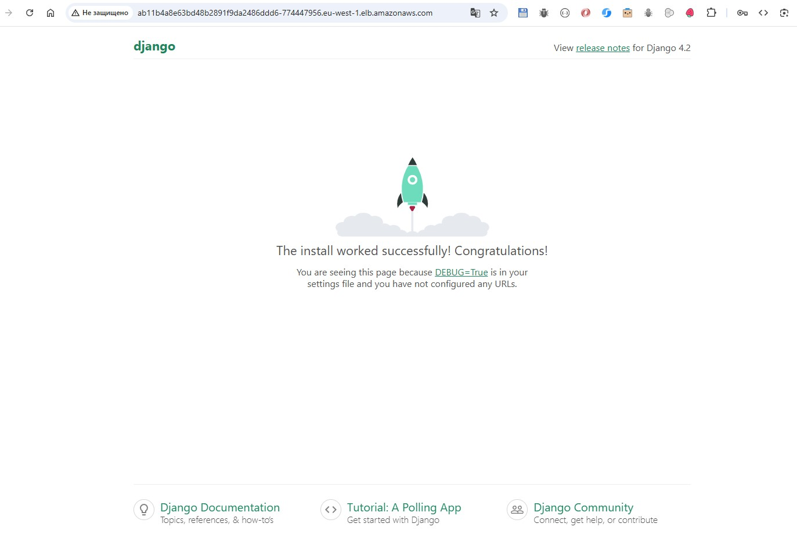
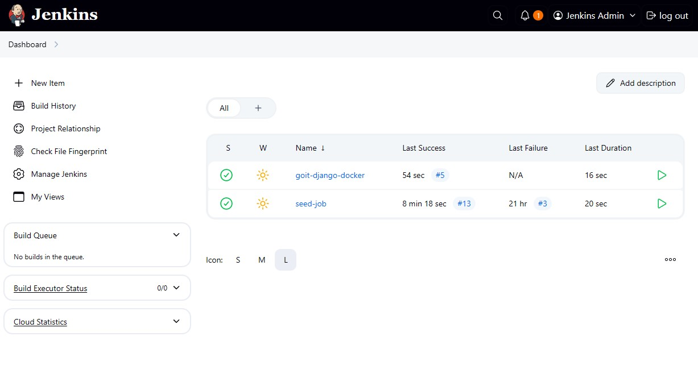
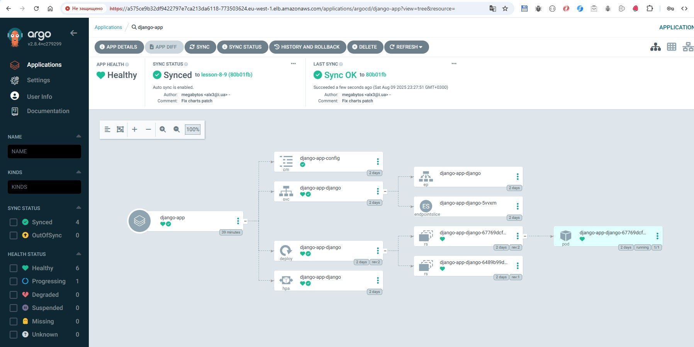

# HW 8-9 - Terraform, Kubernetes and Helm, Jenkins, Argo CD

This project provide basic AWS infrastructure using Terraform with modular structure and remote state backend.

## Project Structure

```
├── backend.tf             # S3 + DynamoDB backend configuration
├── main.tf                # Main entry point to invoke modules
├── Jenkinsfile            # CI pipeline definition
├── django/                # Application for image building
├── modules/               # Terraform modules
│ ├── s3-backend/          # Remote state backend (S3 + DynamoDB) module
│ ├── vpc/                 # Network infrastructure (VPC) module
│ ├── ecr/                 # Docker image repository (ECR) module
│ ├── eks/                 # Kubernetes cluster (EKS) module
│ ├── jenkins/             # Jenkins Helm deployment + config
│ └── argo_cd/             # Argo CD Helm deployment + Application management
├── charts/                # Helm charts
```


## Cloning the Repository
1. Clone the repo
```shell
git clone <repository-url>
```

2. Checkout branch `lesson-7`
```shell
git checkout lesson-7
```

## AWS Configuration

```bash
aws configure
# Enter your AWS credentials
```
---

## Preparing the Backend (S3 + DynamoDB)

Before you start, you need to create the backend to store the Terraform state (terraform.tfstate) and to enable locking to prevent conflicts during team collaboration.
To do this:

1. Navigate to the `s3-backend` folder:

```bash
cd s3-backend
```

2. Initialize Terraform, review the plan, and create the backend resources:

```bash
terraform init
terraform plan
terraform apply
```

This will create:

- An S3 bucket to store the state
- A DynamoDB table for state locking

---

## Creating the Infrastructure

After the backend is created, return to the root folder with the main Terraform configuration and run the standard commands to create the infrastructure.

It is recommended to comment out the s3_backend creation block in main.tf and the output data of this module in outputs.tf before this.

Initialize Terraform:

```bash
terraform init
```

Review the changes:

```bash
terraform plan
```

Apply the changes:

```bash
terraform apply
```

View the outputs:

```bash
terraform output
```
---


## Deploying an Application with Kubernetes and Helm

Before you begin, please make sure the following tools are installed:
- Install [kubectl](https://kubernetes.io/docs/tasks/tools/)
- Install [helm](https://helm.sh/docs/intro/install/)

Get access to EKS cluster
```bash
aws eks update-kubeconfig --region <region> --name <cluster_name>
```

## Building and pushing a Docker image to ECR repository

Authenticate Docker with ECR
```bash
aws ecr get-login-password --region <your-region> | docker login --username AWS --password-stdin <your-account-id>.dkr.ecr.<your-region>.amazonaws.com
```

Build the Docker image
```bash
docker build -t <your-ecr-repo-name> ./docker
```
Tag the image
```bash
docker tag <your-ecr-repo-name>:latest <your-account-id>.dkr.ecr.<your-region>.amazonaws.com/<your-ecr-repo-name>:latest
```
Push the image to the ECR repository
```bash
docker push <your-account-id>.dkr.ecr.<your-region>.amazonaws.com/<your-ecr-repo-name>:latest
```

## Deploy Application using Helm

Navigate to the `helm charts` folder:
```bash
cd charts/django-app
```

Install the Helm release
```bash
helm install <your-app-name> .
```

Upgrade the Helm release
```bash
helm upgrade <your-app-name> .
```

## Accessing the Application

Find the LoadBalancer address (EXTERNAL-IP)
```bash
kubectl get svc
```

Open the EXTERNAL-IP in your browser
```bash
http://<external-dns>
```



## Checking the Deployment

List all Kubernetes resources
```bash
kubectl get all
```

Check the logs of the pods
```bash
kubectl logs -f <pod_name>
```
## Jenkins CI module

Find the Jenkins LoadBalancer address (EXTERNAL-IP)
```bash
kubectl get svc -n jenkins
```
Open the Jenkins EXTERNAL-IP in your browser
```bash
http://<external-dns>
```
To get the password, run the command and copy the result (login is `admin`)
```bash
kubectl get secret jenkins -n jenkins -o jsonpath="{.data.jenkins-admin-password}" | base64 --decode && echo
```


After logging into Jenkins you will see the seed-job on the main Dashboard page. 
* Go to the seed-job pipeline and click on Build now 
* For the first run you need to approve the script, for this go to Dashboard -> Manage Jenkins -> In-process Script Approval and approve the seed-job 
* As a result of executing the seed-job the goit-django-docker pipeline should be created
---

## Argo CD module

Find the ArgoCD LoadBalancer address (EXTERNAL-IP)
```bash
kubectl get svc -n argocd
```
Open the ArgoCD EXTERNAL-IP in your browser
```bash
http://<external-dns>
```

To get the password, run the command and copy the result (login is `admin`)
```bash
kubectl -n argocd get secret argocd-initial-admin-secret -o jsonpath={.data.password} | base64 -d
```


After logging in, the app should be in Healthy status.

---

## Removing Resources

Check the Helm release name (e.g., django-app):

```bash
helm list
```

Uninstall the Helm release

```bash
helm uninstall <your-app-name>
```

## Destroying the Infrastructure

If you need to remove the infrastructure created with Terraform

```bash
terraform destroy
```
To completely clean up cached files, you can run:

```bash
rm -rf .terraform .terraform.lock.hcl terraform.tfstate terraform.tfstate.backup
```